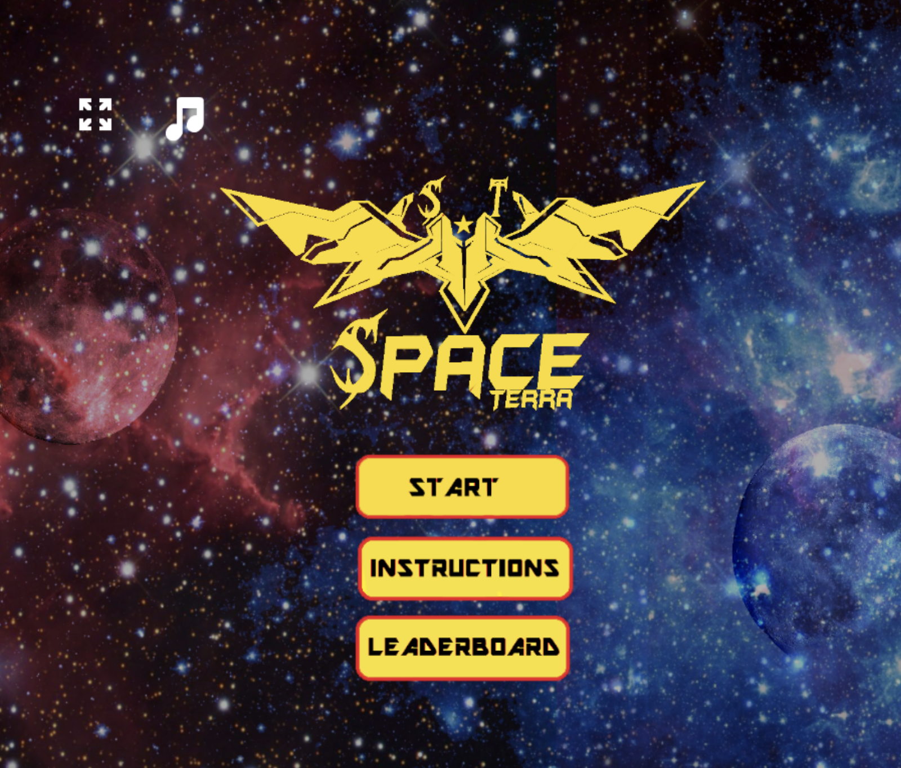
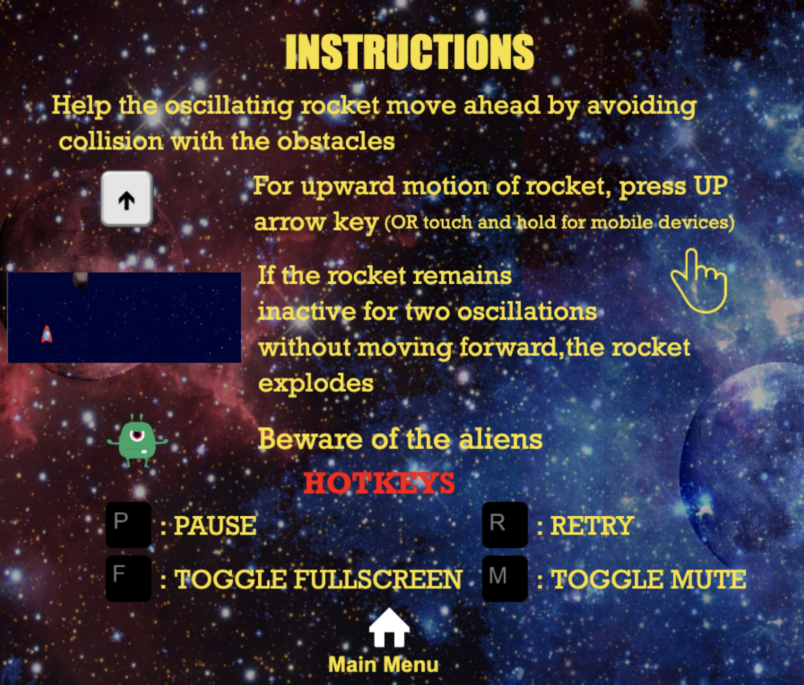
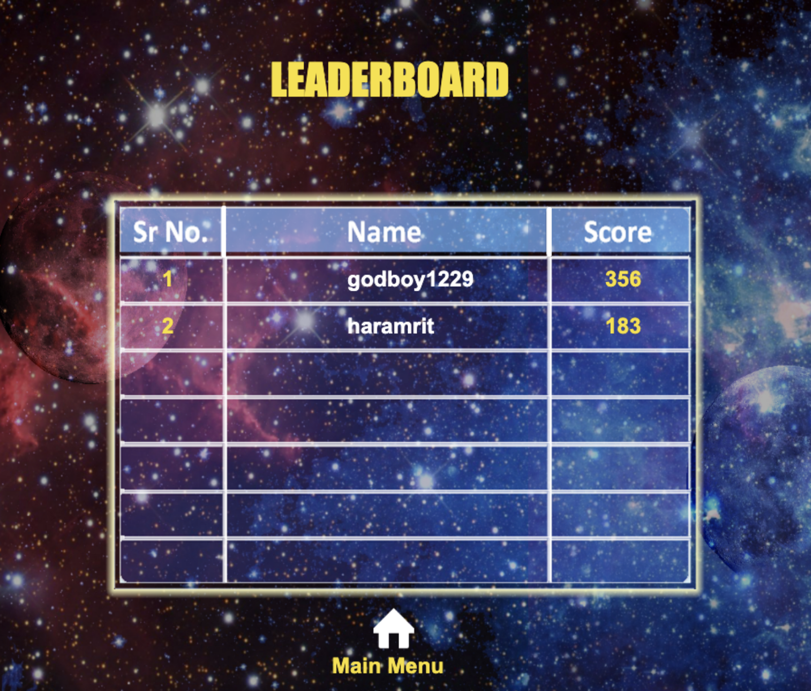
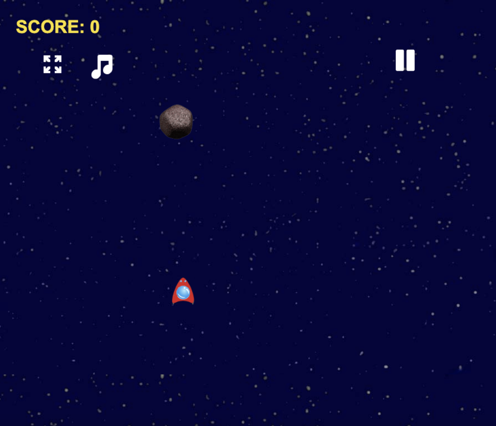

# spaceterra
### {developed by Haramrit Singh Khurana}

Click [here](spaceterra.herokuapp.com) to try the game!

#### About:
SpaceTerra is a simple single-player game inspired by the game [Sine Line](https://play.google.com/store/apps/details?id=com.ThirdState.SineLine&hl=en_US&gl=US)

#### Tech Stack:
 - Phaser.io game engine (for creating the game)
- Node.js (backend environment)
- Express (server)
- MongoDB (database)
- Heroku (for hosting)

#### Screenshots:

Home Page

